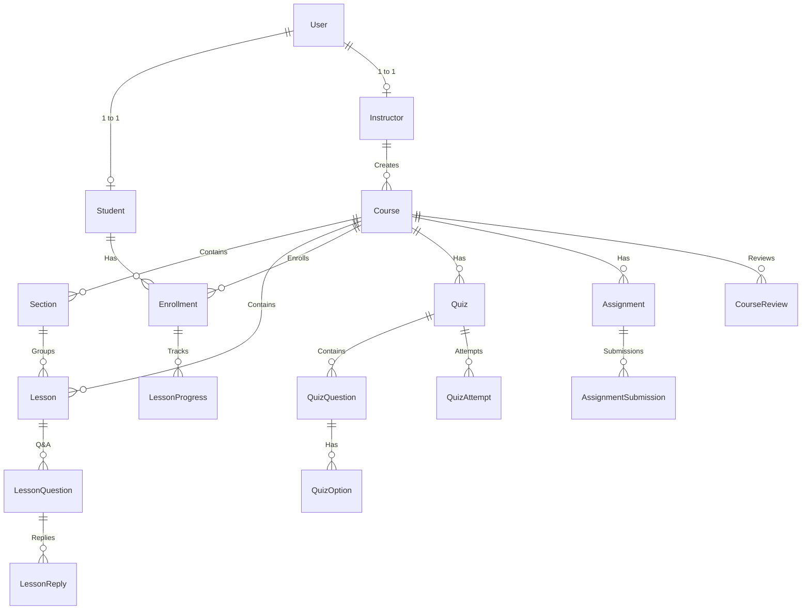

# 🎓 MiniLMS - Comprehensive System Documentation
## التوثيق الفني الشامل لمنصة إدارة التعلم الإلكتروني (Mini Learning Management System)

---

## 🌟 1. نظرة عامة على المنصة (Project Overview)
تم تصميم وتطوير منصة **MiniLMS** لتكون منصة تعليمية ذكية، متكاملة وقابلة للتوسع (Enterprise-Grade LMS) تدعم نمط العمل المتعدد للمدربين والطلاب بنمط منصات مثل **Udemy** و **Coursera**.

### 🔹 الأدوار والمستخدمين (Roles & Permissions):
1. **المدير (Admin)**: التحكم الكامل في المنصة، مراجعة واعتماد الكورسات، وإدارة المستخدمين.
2. **المدرب (Instructor)**: إنشاء وإدارة الكورسات الخاصة به، بناء الفصول والدروس، إنشاء الاختبارات والتكليفات، تصحيح واجبات الطلاب، والرد على استفسارات الطلاب.
3. **الطالب (Student)**: تصفح الكتالوج، التسجيل في الكورسات، مشاهدة الدروس واستئناف المشاهدة من آخر ثانية، خوض الاختبارات، تسليم الواجبات، المشاركة في نقاشات الدروس، وتقييم الكورسات.

---

## 🏗️ 2. الهيكلية المعمارية (Architecture)

تم بناء النظام باستخدام أحدث المعايير البرمجية:
- **Backend**: ASP.NET Core 9 Web API مبني وفق مبادئ **Clean Architecture** ومقسم إلى:
  - `MiniLMS.Data` (Entities, Fluent API, DbContext).
  - `MiniLMS.Business` (Services, DTOs, AutoMapper Profiles, Business Rules).
  - `MiniLMS.API` (REST Controllers, JWT Auth, Swagger).
- **Frontend**: Angular (Standalone Components, Signals, Reactive Architecture, Bootstrap 5 & Icons).
- **Database**: Microsoft SQL Server مع Entity Framework Core 9.

---

## 🗄️ 3. هيكل قاعدة البيانات والنماذج (Database Models)



### 📋 تفاصيل الجداول:
1. **`Users`**: الحسابات الأساسية، كلمات المرور المشفرة بـ `PasswordHasher`، والرتبة (`Role`: Admin, Instructor, Student).
2. **`Instructors`**: الملف الشخصي للمدرب، المسمى الوظيفي (`Headline`)، النبذة (`Bio`)، وصورة وروابط الحسابات (LinkedIn, GitHub, YouTube, Website).
3. **`Students`**: بيانات الطلاب واشتراكاتهم.
4. **`Courses`**: الكورسات، حالات المراجعة والاعتماد (`Draft`, `PendingReview`, `Approved`, `Rejected`)، متوسط التقييم (`AverageRating`)، وعدد المراجعات.
5. **`Sections` & `Lessons`**: هيكل الدورة، أنواع الدروس (فيديو، مقال، مرفقات)، روابط الفيديوهات، والمدة الزمنية.
6. **`LessonProgresses`**: تتبع تقدم الطالب، وقت التوقف الأخير بالثواني (`LastWatchedSeconds`)، ونسبة المشاهدة (`WatchPercentage`).
7. **`Quizzes`, `QuizQuestions`, `QuizOptions`, `QuizAttempts`**: بنك الأسئلة، التصحيح التلقائي، وحساب درجات النجاح.
8. **`Assignments`, `AssignmentSubmissions`**: تكليفات الطلاب، روابط التسليم، وتصحيح المدرب مع الملاحظات.
9. **`LessonQuestions`, `LessonReplies`**: منتدى الأسئلة والنقاشات لكل درس مع التوقيت في الفيديو (`VideoTimestampSeconds`) والتصويت.
10. **`CourseReviews`**: تقييمات الطلاب من 1 إلى 5 نجوم مع التعليقات.

---

## 🔌 4. دليل واجهات برمجة التطبيقات (API Endpoints Catalog)

### 🔐 1. المصادقة والحسابات (`/api/Auth`)
| Method | Endpoint | Description |
|---|---|---|
| `POST` | `/api/Auth/register` | إنشاء حساب جديد (طالب أو مدرب مع بيانات الملف الشخصي) |
| `POST` | `/api/Auth/login` | تسجيل الدخول وتوليد JWT Token مع الدور |

### 📚 2. إدارة الكورسات للمشرف (`/api/AdminCourses`) [Admin]
| Method | Endpoint | Description |
|---|---|---|
| `GET` | `/api/AdminCourses` | جلب جميع الكورسات في المنصة |
| `POST` | `/api/AdminCourses` | إنشاء كورس جديد |
| `GET` | `/api/AdminCourses/pending-review` | جلب الكورسات المعلقة للمراجعة |
| `POST` | `/api/AdminCourses/{id}/approve` | اعتماد ونشر كورس المدرب |
| `POST` | `/api/AdminCourses/{id}/reject` | رفض الكورس مع إرسال الملاحظات |
| `POST` | `/api/AdminCourses/{courseId}/sections` | إضافة فصل جديد |
| `POST` | `/api/AdminCourses/sections/{id}/lessons` | إضافة درس إلى قسم |

### 👨‍🏫 3. بوابة المدربين (`/api/InstructorCourses` & `/api/Instructors`) [Instructor]
| Method | Endpoint | Description |
|---|---|---|
| `GET` | `/api/InstructorCourses` | كورسات المدرب الحالي فقط |
| `POST` | `/api/InstructorCourses` | إنشاء كورس بحالة `Draft` |
| `POST` | `/api/InstructorCourses/{id}/submit-review` | إرسال الكورس للاعتماد والمراجعة |
| `GET` | `/api/InstructorCourses/students` | تقرير الطلاب المسجلين لدى المدرب ونسب إنجازهم |
| `GET` | `/api/Instructors/profile` | جلب وتعديل بيانات ملف المدرب |

### 🎓 4. بوابة الطالب والتعلم (`/api/StudentCourses`) [Student]
| Method | Endpoint | Description |
|---|---|---|
| `GET` | `/api/StudentCourses/available` | استعراض كتالوج الكورسات المنشورة |
| `POST` | `/api/StudentCourses/enroll/{courseId}` | التسجيل والاشتراك في كورس |
| `GET` | `/api/StudentCourses/my-courses` | كورسات الطالب المشترك بها |
| `GET` | `/api/StudentCourses/details/{courseId}` | جلب المحتوى والفصول مع تتبع الإنجاز |
| `POST` | `/api/StudentCourses/enrollments/{eId}/lessons/{lId}/watch-progress` | حفظ وقت التوقف اللحظي ونسبة المشاهدة والإكمال التلقائي عند 80% |

### 📝 5. الاختبارات القصيرة (`/api/Quizzes`)
| Method | Endpoint | Description |
|---|---|---|
| `GET` | `/api/Quizzes/course/{courseId}` | جلب اختبارات الكورس |
| `POST` | `/api/Quizzes/course/{courseId}` | إنشاء اختبار جديد مع الأسئلة والخيارات [Admin/Instructor] |
| `POST` | `/api/Quizzes/{id}/submit` | تسليم الإجابات والتصحيح التلقائي الفوري وحساب النتيجة |
| `GET` | `/api/Quizzes/{id}/attempts` | سجل محاولات الطالب والدرجات |

### 📂 6. الواجبات والتكليفات (`/api/Assignments`)
| Method | Endpoint | Description |
|---|---|---|
| `GET` | `/api/Assignments/course/{courseId}` | جلب واجبات الكورس |
| `POST` | `/api/Assignments/{id}/submit` | تسليم الواجب (رابط المشروع / ملاحظات) [Student] |
| `GET` | `/api/Assignments/{id}/submissions` | مراجعة تسليمات الطلاب [Admin/Instructor] |
| `POST` | `/api/Assignments/submissions/{id}/grade` | تقييم الواجب وإعطاء الدرجة والملاحظات [Admin/Instructor] |

### 💬 7. الأسئلة والنقاشات (`/api/QnA`)
| Method | Endpoint | Description |
|---|---|---|
| `GET` | `/api/QnA/lessons/{lessonId}` | استعراض نقاشات وأسئلة الدرس |
| `POST` | `/api/QnA/lessons/{lessonId}` | طرح سؤال مع خيار ربطه بتوقيت الدقيقة في الفيديو |
| `POST` | `/api/QnA/questions/{id}/replies` | الرد على السؤال من المدرب أو الطلاب |
| `POST` | `/api/QnA/questions/{id}/upvote` | التصويت للإعجاب بالسؤال |
| `POST` | `/api/QnA/replies/{id}/accept-answer` | اعتماد الرد كـ "أفضل إجابة" |

### ⭐ 8. التقييمات والمراجعات (`/api/Reviews`)
| Method | Endpoint | Description |
|---|---|---|
| `GET` | `/api/Reviews/course/{courseId}` | استعراض مراجعات الكورس |
| `GET` | `/api/Reviews/course/{courseId}/summary` | جلب متوسط التقييم وتوزيع النجوم |
| `POST` | `/api/Reviews/course/{courseId}` | كتابة تقييم ومراجعة (1-5 نجوم) |

### 👥 9. إدارة المستخدمين واستعراض الطلاب والمدربين (`/api/AdminUsers` & `/api/Instructors`)
| Method | Endpoint | Description |
|---|---|---|
| `GET` | `/api/AdminUsers/students` | جلب جميع الطلاب مع إحصائيات الاشتراكات والكورسات المكتملة [Admin] |
| `GET` | `/api/AdminUsers/students/{id}` | جلب بيانات وتفاصيل طالب محدد وكورساته [Admin] |
| `GET` | `/api/AdminUsers/instructors` | جلب جميع المدربين مع عدد الكورسات والطلاب الإجمالي [Admin] |
| `GET` | `/api/AdminUsers/instructors/{id}` | جلب تفاصيل مدرب محدد [Admin] |
| `GET` | `/api/Instructors` | استعراض قائمة جميع المدربين مع ملفاتهم الشخصية [Public] |

---

## 💻 5. دليل تنفيذ الـ Migration في Visual Studio

لتحديث قاعدة البيانات بالهياكل والجداول الجديدة، افتح **Package Manager Console** في Visual Studio واكتب:

```powershell
Add-Migration AddFullEngagementAndInstructorModules
Update-Database
```

---

## 🚀 6. تشغيل المشروع (Running the Solution)

1. **الـ Backend**:
   - قم بالضغط على **F5** في Visual Studio لتشغيل الـ API على `https://localhost:7070`.
2. **الـ Frontend**:
   - داخل مجلد `MiniLMS.Client`:
   ```powershell
   ng serve --open
   ```
   - سيفتح التطبيق في المتصفح على `http://localhost:4200`.

---
*تم إعداد هذا التوثيق ليكون مرجعاً تقنياً وهندسياً متكاملاً للمشروع.* ✨
